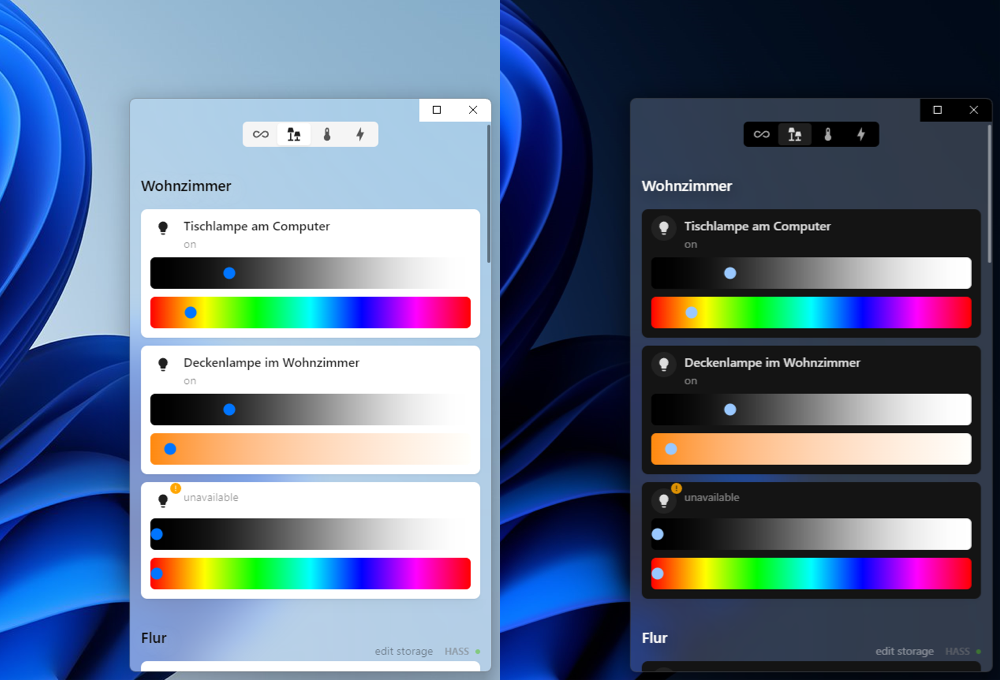

# HushFungi

HushFungi is an Electron-based application designed to streamline the management of your Home Assistant instance, offering speed and simplicity. Drawing inspiration from the visually appealing [Mushroom](https://github.com/piitaya/lovelace-mushroom) cards and organizational structure of Apple Home App, HushFungi aims to provide users with a straightforward interface while harnessing the full power of Home Assistant.

The utmost important focus is that the app is as unobtrusive as possible, allowing you to make the changes you want and continue seamlessly.

## Features

- **Simplicity:** HushFungi prioritizes a clean and intuitive design, enabling users to navigate and utilize Home Assistant functionalities efficiently.
- **Customizability:** Enjoy a simple out-of-the-box experience with the flexibility to customize HushFungi to suit your preferences and needs.
- **Platform Support:** HushFungi is designed to adapt seamlessly to both Windows and macOS environments, ensuring accessibility across different platforms.

## Installation

TBD - missing gitlab ci

## Project Goals

Despite the availability of existing options, none seem tailored to meet my specific needs or maintain the desired level of quality.

Applications that merely expose the HASS frontend through a simple WebView lack the flexibility necessary for the modifications I intend to make in my smart home. Additionally, they often require extensive UI configuration efforts.

My usage of the HASS frontend primarily revolves around obtaining an overview and serving as a control center for all entities. While aesthetics are important, I do not access it frequently.

Given the extensive automation in my home, my interactions with the smart home primarily involve Apple's Home app, switches, dials, and voice assistants, reserving manual input for special occasions or instances where automated actions are impractical.

This led me to the goal for this application. I would like an application that is well-integrated into their environment (Windows, macOS - such as the case with the Home app from Apple) while still respecting the aesthetics of HASS. Additionally, I've noticed that while the Home app does not sync with HASS areas, its automated grouping of them is much more sensible and quicker to navigate for me.

All of this underscores some key points to keep in mind while developing this application:

- Use the same APIs and Libraries that HASS uses.
- Respect the platform-specific design experiences as much as possible ([Windows](https://learn.microsoft.com/en-us/windows/apps/design/signature-experiences/design-principles), [macOS](https://developer.apple.com/design/human-interface-guidelines)).
- HASS is slowly integrating a variant of [Mushroom](https://github.com/piitaya/lovelace-mushroom), so I am focused on Paul's design vision.
  - However, I decided not to reuse his web components because of the complexity and uncertainty regarding how his work is being integrated into HASS for the long term.
  - I am also unsure how difficult it would be to leverage them while still implementing escape hatches for native handling.

### Useful links

- [UI Design Dos and Don’ts](https://developer.apple.com/design/tips/)

## Roadmap

See [HushFungi Roadmap](https://github.com/users/max-scopp/projects/2)

## Development

### Getting started

To get started with HushFungi, follow these steps:

1. Clone this repository to your local machine.
2. Navigate to the project directory.
3. Install dependencies using `npm install`.
4. Launch the application with `npm start`.

### Contribution

Contributions are welcome! If you'd like to contribute to HushFungi, please follow these guidelines:

- Fork the repository.
- Create a new branch for your feature or bug fix.
- Make your changes and ensure that they are well-tested.
- Submit a pull request detailing your changes.

### License

MIT
